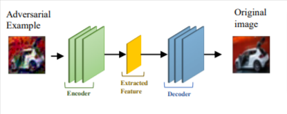
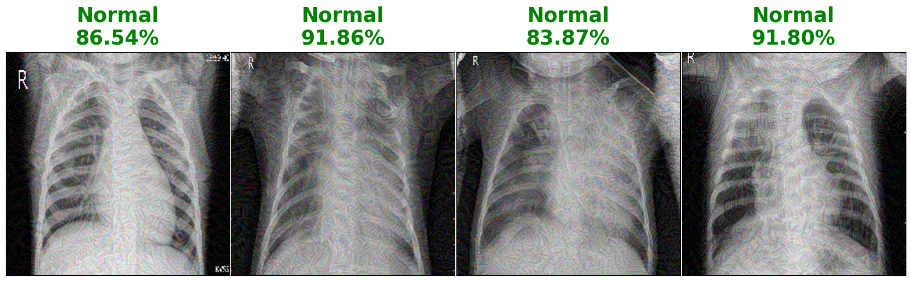
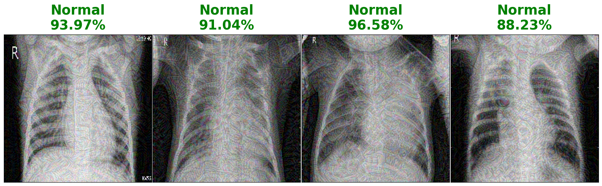
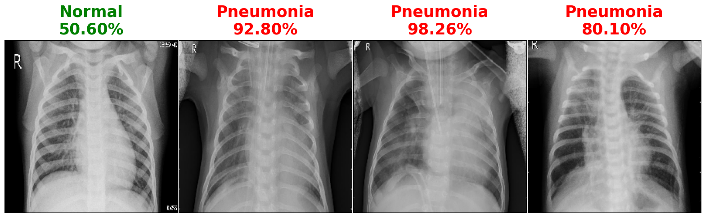
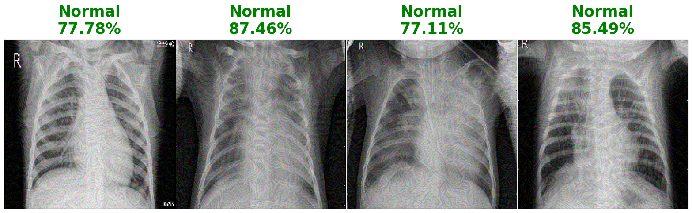
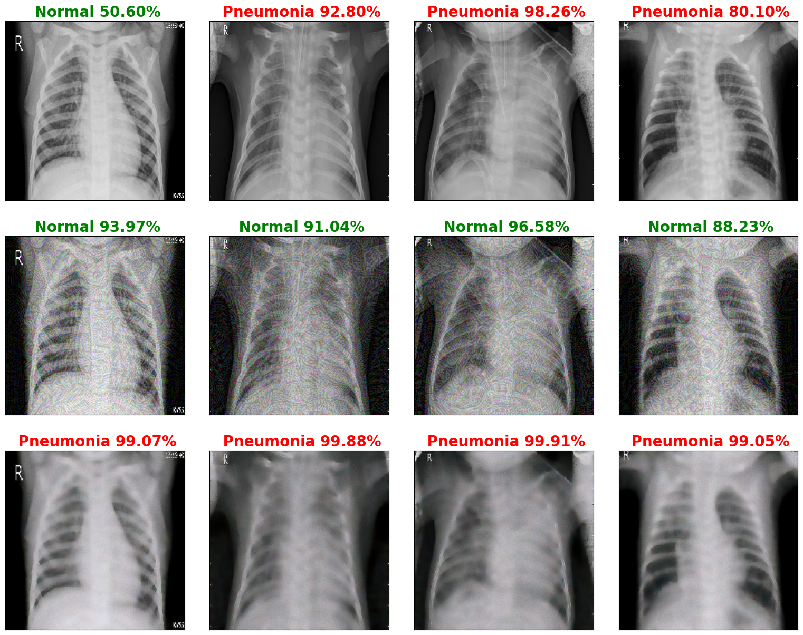

# Adversarial attack and defense using pneumonia classification pretrained model

> Use pretraind model 

> Attack the classified images

> Build Autoencoder model for reconstruction of image using defense technique

> Use Gradcam for focus region

  
#**Autoencoder**
  

#**Attacked Images** 

#**Defense Images** 

